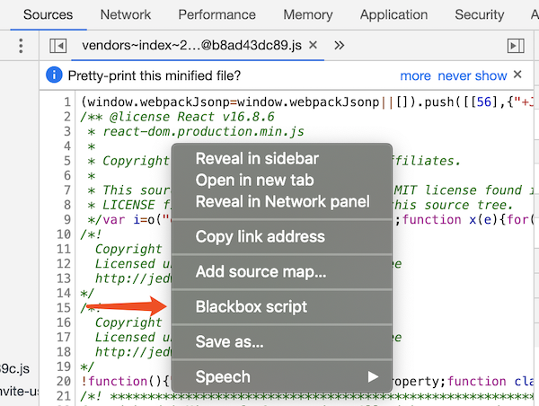

在 Chrome 调试的构成中，单步执行代码是常有的操作。然而，一般来说，出问题的很可能是业务代码，具体依赖的库（如 React 或者 Mobx 等）相对则是更加稳定的。如果单步调试的过程中，会频繁进出库相关的代码，显然会对调试造成很多的干扰，不利于问题的排查。

为此，Chrome 提供了 Blackbox 的功能，可以帮助将部分指定的文件从调试中剔除。一旦使用 Blackbox 剔除了某些代码文件，那么：

+ 从这些文件中造成的报错不会暂停代码（除非开启了 Pause on exception）
+ Step in/out/over 不会执行到这部分的代码
+ 这些文件中的事件监听断点不会触发
+ 文件中设置的断点也不会被触发（代码不会暂停）

有几个方法可以添加 Blackbox：

1. 打开 DevTools 后按 F1 打开 Settings 界面，然后选择 Blackboxing 并填写

如果网站的标准库是通过 CDN 文件直接引入的，可以把文件名直接写在这里，如 `react.min.js` 或是 `jquery.min.js` 等；类似的，如果页面是通过 Webpack 进行打包的，那么 vendor 的部分很可能也会打包到一个独立的文件中，比如就叫 `vendor.xxx.js`，那么也可以把相应的匹配写在这里。

2. 打开 DevTools 后在 Sources 标签下找到需要屏蔽的文件，在文件内容处右键，并选择 Blackbox

[参考文档](https://developer.chrome.com/devtools/docs/blackboxing)
