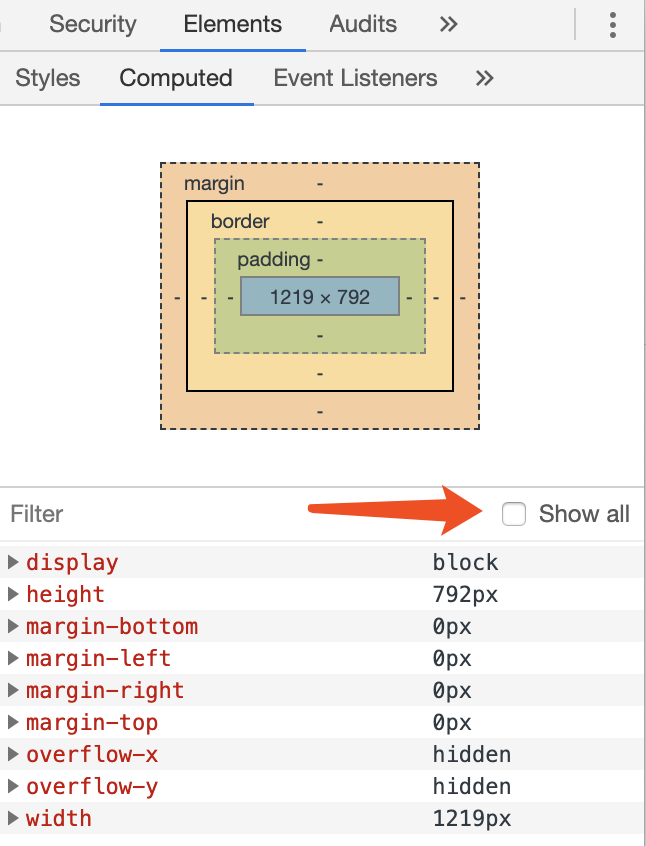
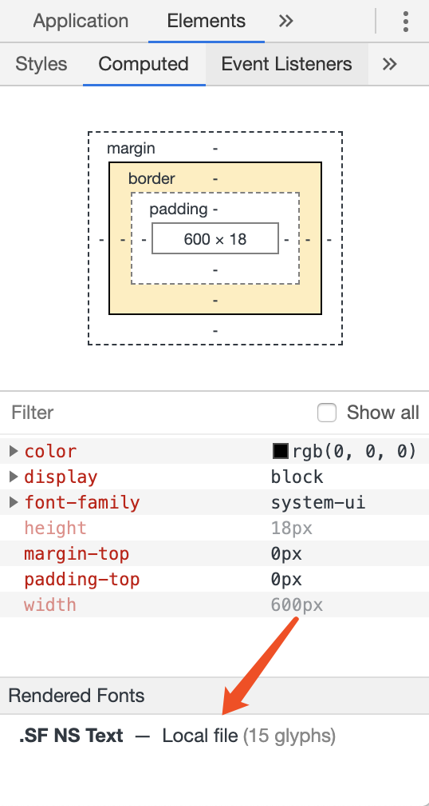

要知道一个网页中的文本，具体是使用什么字体渲染出来的，并不是非常简单的事情，可以有以下一些方案进行尝试。

## getComputedStyle

使用 `window.getComputedStyle` 属性获取对应元素的 `font-family` 字段。因为字体的设置一般是通过顶层配置，子元素继承的方式完成的，因此在大多数的元素上，并没有 `font-family` 设置。即使有，大概率也是通过 CSS 完成的，因此从 `.style` 或者 `.attributeStyleMap` 无法拿到需要的数据。`getComputedStyle` 可以获取当前元素上样式的最终计算值，因此即使字体实际来自于继承或者系统默认字体，都可以通过该 API 获取到。比如，在一个没有 CSS 设置的页面上，可以通过下面的代码知道具体使用的系统默认字体是什么：

```javascript
window.getComputedStyle(document.body).fontFamily;
// MacOS (Chrome): Times
// Windows (Chrome): Microsoft YaHei
```

非编程的方案，可以在 Chrome DevTools 中直接找到 Elements 下的 Computed 部分，查看实际使用的 CSS 属性值。注：如果 `font-family` 并没有被定义过，可以勾选 All 来查看系统默认的属性值。



## Rendered Fonts

使用 `getComputedStyle` 只能得到实际使用的 CSS 属性值，有时候并不能准确表达实际真实使用的具体字体类型。

举例来说，一个 `font-family` 定义可能是：

```css
body {
  font-family:
    'Rubik',
    -apple-system, 'system-ui', 'BlinkMacSystemFont', 'PingFang SC',
    'Segoe UI', 'Roboto', 'Oxygen',
    'Ubuntu', 'Cantarell', 'Fira Sans', 'Droid Sans',
    'Helvetica Neue', 'Helvetica', 'Arial', 'Hiragino Sans GB',
    'Microsoft Yahei', 'WenQuanYi Micro Hei', sans-serif；
}
```

在如此众多的定义中，具体浏览器使用了哪一款字体，并不容易知道。这其中涉及到了大量的变量。用户使用的系统环境、字体下载情况、正在阅读的文字是中文还是英文等，这些都有可能影响到最终浏览器所选用的字体。甚至在不复杂的 `font-family` 设置下，最终的选用字体依然可能并不直观。举例来说，如果设置 CSS 为：`font-family: system-ui`，具体使用的字体并没有从设置的字段中直观的反馈出来。

Chrome DevTools 提供了一个 Rendered Fonts 功能，可以帮助开发者了解当前真实使用的字体。示意图如下：



Chrome 会将当前选中元素真实使用的所有字体都列出来。需要注意两点：

1. 需要选中一个有文字内容的元素，不然这里并不会显示；

2. 选中的文字内容可能需要多种字体类型共同配合渲染，Chrome 会讲所有用到的元素都列举出来。

   比如，`笑，😊，smile` 这样一段文字，在 MacOS Chrome 下，默认就需要以下三种字体来进行渲染：

   + Times（渲染英文）
   + Songti SC（渲染中文）
   + Apple Color Emoji（渲染 emoji）

   以上三种字体在 Rendered Fonts 中都会被列举出来。

Chrome 的 Blog 介绍可以查看[这里](https://developers.google.com/web/updates/2013/09/DevTools-answers-What-font-is-that)。

这一方案暂时没有 JavaScript API 可以直接调用，无法在程序运行时进行自动的判断。
