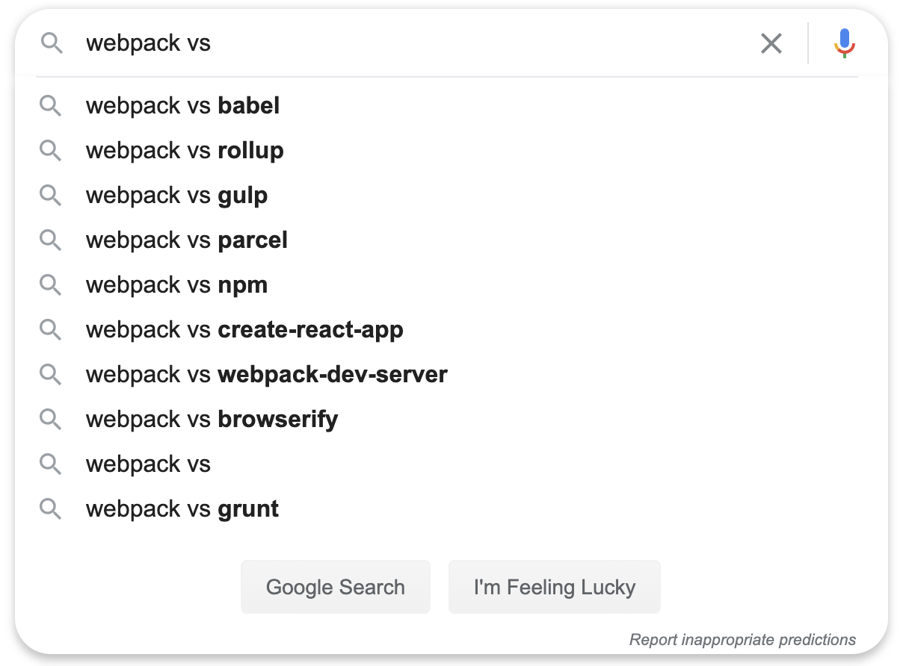

当用户试图比较两样东西的时候，经常会在 Google 中输入 `xxx vs xxx` 来进行搜索。而 Google 的搜索关键词自动填充功能可以很好得展示用户常见的输入内容。因此，当已知一个关键词 A，就很容易在 Google 中通过 `A vs` 这样的关键词去触发自动填充功能，从而找到和 A 近似的其他关键词 B，C，D。

比如，查找和 Webpack 相关的关键词：

既然可以通过这个方法知道 A 相近的关键词 B，那么通过同样的方法，递归一下，就可以知道 B 的关键词 C。如此往复，就可以生成一张相近关键词的无向图（之所以是“无向图”是因为默认 vs 是满足交换律的）。

[这里](https://anvaka.github.io/vs/?query=)提供了一个可视化的工具，只要输入一个关键词，就可以递归的调用 Google 的接口，最终生成一个无向图。工具的源代码在[这里](https://github.com/anvaka/vs)。其中，具体查询 Google Suggestion API 的代码在[这里](https://github.com/anvaka/vs/blob/2bceaa530dc933cc193bbcb54e8d11483769b9f5/src/lib/buildGraph.js#L121)可以找到。

关于这个 Google Suggestion API 的用法介绍（包括 Google vs 的技巧介绍），可以参考[另外一篇文章](https://medium.com/applied-data-science/the-google-vs-trick-618c8fd5359f)。
